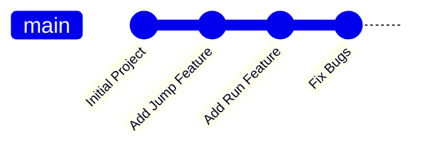
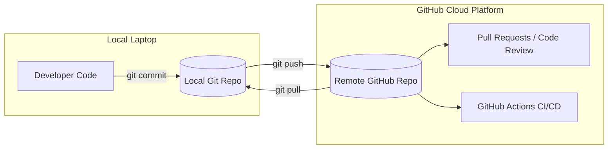

# 📁 Chapter 1: Git & GitHub Fundamentals

Is chapter mein hum **Git** aur **GitHub** ke bunyadi concepts ko aasan tareeqe se samjhein ge.

---

## 1. Git Kya Hai? (Version Control System)

### 💡 Simple Definition
Git ek **Version Control System (VCS)** hai. Yeh aapke code ka **"Time Machine"** hai. 

Matlab jo code aap likh rahe hain, uski har ek change ka poora record rakha jata hai. Agar aaj aapka code kharab ho jaye ya crash kar jaye, toh aap aik single command se kal wale sahi chalne wale code par wapas ja sakte hain.

### 🎮 Real-Life Example
Maan lo aap ek video game bana rahe hain:
* **Day 1:** Aapne character ka **"Jump"** feature add kiya.
* **Day 2:** Aapne character ka **"Run"** feature add kiya.

Git in dono changes ka ek **screenshot / snapshot (Commit)** save kar leta hai. Agar "Run" feature add karne ke baad game crash ho jaye, toh aap bina kisi pareshani ke wapas "Jump" wale version par switch kar sakte hain.



---

## 🔑 Git ki Important Terminology

| Term | Roman Urdu Explanation | English Meaning |
| :--- | :--- | :--- |
| **Repository (Repo)** | Ek folder jahan aapka project aur uski mukammal history rehti hai. | Project workspace containing all files and history. |
| **Commit** | Code ka ek save point (Jaise game mein checkpoint). | A snapshot of changes saved to history. |
| **Branch** | Main code ko chhere baghair naye features par alag kaam karna. | An isolated line of development. |
| **Merge** | Do alag branches ke code ko aapas mein milana. | Combining changes from one branch into another. |
| **Local vs Remote** | Local aapka apna computer hai. Remote cloud server (GitHub) hai. | Local is your machine; Remote is the hosted server. |
| **Staging Area (Index)** | Commit karne se pehle files ko tayyar karna (`git add`). | The preparation area before committing changes. |

---

## 2. GitHub Kya Hai? (Cloud Hosting for Git)

### 💡 Simple Definition
GitHub ek **cloud platform aur website** hai jahan aap apne Git repositories ko **online store aur backup** kar sakte hain. Yeh duniya bhar ke developers ka **social network & collaboration platform** bhi hai.



### ⚖️ Git vs GitHub: Farq Kya Hai?

* **Git:** Yeh ek **tool / software** hai jo aapke computer par locally chalta hai (Command Line ya GUI ke zariye).
* **GitHub:** Yeh ek **website / cloud service** hai jahan Git repos ko internet par host kiya jata hai.
* *Analogy:* Jaise **Microsoft Word** ek tool hai document likhne ke liye, aur **Google Drive** ek cloud platform hai us document ko online save karne ke liye.

---

## 🌟 GitHub ke Core Features

1. **Cloud Backup:** Aapka code cloud par hamesha safe rehta hai, chahe laptop kharab hi kyun na ho jaye.
2. **Team Collaboration:** Hazaron developers ek sath ek hi project par bina kisi conflict ke kaam kar sakte hain.
3. **Pull Request (PR):** Jab aap naya feature banate hain, toh aap PR create karte hain. Senior developers code review karte hain aur approve hone ke baad code `main` branch mein merge hota hai.
4. **Issue Tracking:** Project ke bugs aur future features ke liye tasks aur tickets create kiye jate hain.
5. **GitHub Actions:** Automated CI/CD pipelines chalane ka powerful system (jo hum aglay chapters mein seekhein ge).

### 🔄 GitHub ke Alternatives
* **GitLab:** Built-in CI/CD ke sath self-hosted options bhi deta hai.
* **Bitbucket:** Atlassian (Jira, Confluence) ke sath deeply integrated hai.
* *Note:* In sab ke bunyadi Git concepts 100% same hain.

---

## 🛠️ Basic Git Workflow (Daily Commands)

Aapka roz-marrah ka Git workflow kuch is tarah hota hai:

```bash
# 1. Pehli baar repository initialize karna
git init

# 2. Files ko staging area mein add karna
git add .

# 3. Checkpoint (Commit) save karna
git commit -m "Pehla commit - Initial project setup"

# 4. GitHub remote repository connect karna
git remote add origin https://github.com/username/my-repo.git

# 5. Code GitHub par push karna
git push -u origin main

# 6. Doosre team members ka code download karna
git pull origin main
```

---

> ⏭️ **Agla Qadam:** Ab jab hum Git aur GitHub ke basics samajh chuke hain, aaiye **[Chapter 2: CI/CD Concepts & Pipeline Flow](./02-cicd-concepts-and-pipeline-flow.md)** mein dekhte hain ke Automation Pipeline kaise kaam karti hai!
