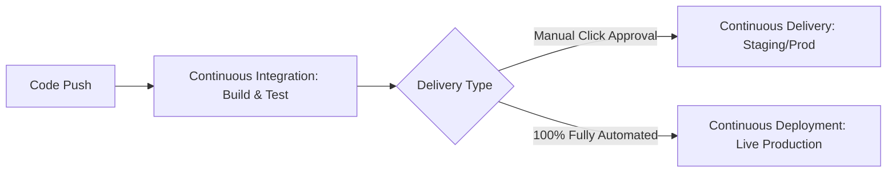
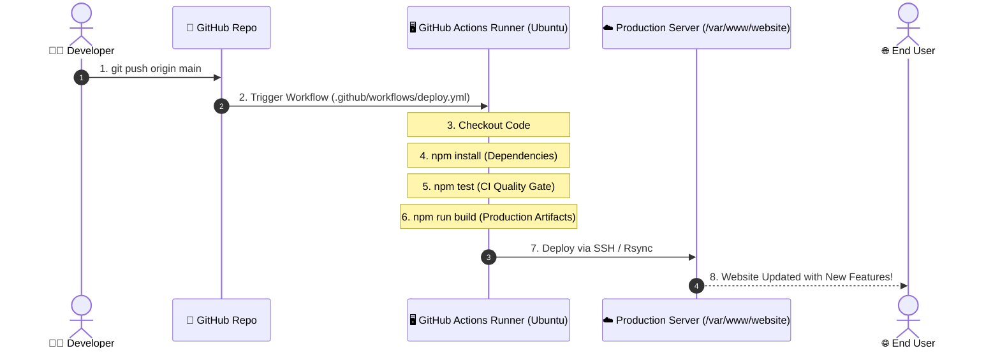

# 🔄 Chapter 2: CI/CD Concepts & Pipeline Flow

Is chapter mein hum samjhein ge ke **CI/CD** kya hota hai aur production grade pipeline ka flow kaisa hota hai.

---

## 1. CI/CD Kya Hai? (Automation Pipeline)

CI/CD ka full form hai:
* **CI:** Continuous Integration ("Baar Baar Code Milana aur Test Karna")
* **CD:** Continuous Delivery / Continuous Deployment ("Automatically Release & Deploy Karna")

---

## 2. CI (Continuous Integration) - "Baar Baar Code Milana"

### 💡 Simple Definition
Jab bhi koi developer apna code GitHub par `git push` karta hai, toh ek **automated system (bot/server)** us code ko foran check karta hai:
1. Kya naya code sahi se build / compile ho raha hai?
2. Kya tamam automated unit tests aur integration tests pass ho rahe hain?
3. Kya code syntax, formatting ya linting mein koi error toh nahi?

### 👥 Real-Life Team Example
Maan lo aapki team mein **5 developers** hain. Agar har koi bina test kiye 1 hafte baad apna code achanak merge kare, toh hazaaron merge conflicts aur bugs paida ho jayenge jise theek karne mein din lag jayenge (jise *Integration Hell* kehte hain).

**CI ka faida:** Har push par automated testing hoti hai. Agar kisi ne koi bug introduce kiya, toh 2 minute ke andar GitHub Actions alert de deta hai ke "Test Fail Ho Gaya". Is se ghalti foran pakri jati hai.

---

## 3. CD (Continuous Delivery vs Continuous Deployment)

Jab CI successfully pass ho jata hai, tab CD ka step shuru hota hai.

| Type | Roman Urdu Explanation | Process |
| :--- | :--- | :--- |
| **Continuous Delivery** | Code production ke liye bilkul tayyar hota hai, lekin deployment ke liye **ek manager ya tech lead ka manual button dabana** zaroori hota hai. | Code -> Build -> Test -> Manual Approval -> Deploy |
| **Continuous Deployment** | Yeh 100% automatic hota hai. Developer ne code push kiya, tests pass hue, aur **bina kisi human intervention ke code live server par deploy** ho gaya. | Code -> Build -> Test -> Automatic Deploy to Live |

---

## 4. Poori CI/CD Pipeline ka Step-by-Step Flow

Maan lo aap ek React / Node.js web application bana rahe hain. Poori pipeline ka step-by-step safar kuch is tarah hota hai:

### Detailed Breakdown of the Steps:

1. **Developer Code Likhta Hai:**
   Aap apne laptop par local Git repository mein features code karte hain.
2. **Code GitHub par Push:**
   Aap terminal se `git push origin main` command chalate hain.
3. **CI/CD Trigger Hota Hai:**
   GitHub repository ke andar `.github/workflows/deploy.yml` file exist karti hai. Push hote hi GitHub ka automation engine start ho jata hai.
4. **CI Steps Chalte Hain:**
   * **Checkout:** GitHub Actions runner par latest code clone hota hai.
   * **Setup Environment:** Node.js / Python / Java runtime configure hota hai.
   * **Install Dependencies:** `npm install` libraries download karta hai.
   * **Run Tests:** `npm test` chalta hai. Agar test fail ho jaye, pipeline yahin cancel ho jati hai.
   * **Build Production Bundle:** `npm run build` static optimized files banata hai.
5. **CD Steps (Deployment):**
   * Runner SSH authentication ke zariye aapke remote production server (e.g. AWS EC2, DigitalOcean, VPS) se connect hota hai.
   * Optimized files ko web root folder (e.g., `/var/www/website/`) mein copy karta hai.
6. **User ko Update Milta Hai:**
   Duniya bhar ke users jab browser mein aapki domain kholte hain, toh unhein bina kisi downtime ke latest features nazar aate hain.

---

## 5. Summary Table

| Term | Roman Urdu Concept | Practical Example |
| :--- | :--- | :--- |
| **Git** | Local computer par code ka history tracker | `git commit -m "Fix bug"` |
| **GitHub** | Code ka online backup aur team hub | `https://github.com/org/app` |
| **CI** | Har push par automatic testing aur building | `npm test` & `npm run lint` |
| **CD** | Tests pass hone ke baad server par upload karna | Server files sync & Nginx reload |
| **Pipeline** | CI + CD ka poora automated sequence | Push ➔ Test ➔ Build ➔ Deploy |

---

> ⏭️ **Agla Qadam:** Aaiye **[Chapter 3: GitHub Actions YAML Deep Dive](./03-github-actions-yaml-deep-dive.md)** mein GitHub Actions ki workflow file ki har ek line ko detail mein samajhte hain!
