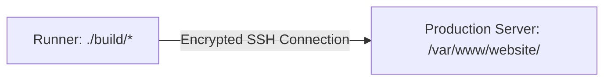

# ⚙️ Chapter 3: GitHub Actions YAML Deep Dive

Is chapter mein hum GitHub Actions workflow file (YAML) ki har ek line ko detail aur real-world examples ke sath decode karein ge.

---

## 📄 Target YAML Workflow File

Yeh file aapke repository mein `.github/workflows/deploy.yml` ke naam se save hoti hai:

```yaml title=".github/workflows/deploy.yml"
name: Deploy Website

on:
  push:
    branches: [ main ]  # Jab main branch par push ho

jobs:
  build-and-deploy:
    runs-on: ubuntu-latest  # Temporary virtual machine
    
    steps:
      - name: Code Download Karo
        uses: actions/checkout@v3
      
      - name: Node Install Karo
        uses: actions/setup-node@v3
        with:
          node-version: '18'
      
      - name: Dependencies Install Karo
        run: npm install
      
      - name: Tests Chalao
        run: npm test
      
      - name: Build Karo
        run: npm run build
      
      - name: Deploy to Server
        run: |
          scp -r build/* user@server:/var/www/website/
```

---

## 🔍 Line-by-Line Breakdown

---

### 1. `name: Deploy Website`
* **Roman Urdu Explanation:** Yeh aapki poori pipeline ka title / naam hai.
* **Example:** Jab aap GitHub repository ke **Actions** tab mein jate hain, toh yeh naam wahan list hota hai taake aap pehchan sakein kaunsi pipeline chal rahi hai (e.g., *Test Pipeline*, *Backup Pipeline*, ya *Deploy Website*).

---

### 2. `on:`
* **Roman Urdu Explanation:** Iska matlab hai **Trigger (Switch)**. Yani yeh pipeline kis event par start hogi?
* **Example:** Jaise kamray mein light ka switch dabane par light on hoti hai, yahan `on:` woh event listener hai.

---

### 3. `push:`
* **Roman Urdu Explanation:** Hum GitHub ko bata rahe hain ke jab bhi code **push** ho, tab yeh workflow chalao.
* **Example:** Jab developer apne laptop ke terminal se `git push` command execute karta hai, yeh event trigger ho jata hai.

---

### 4. `branches: [ main ]`
* **Roman Urdu Explanation:** Hum filter laga rahe hain ke yeh pipeline **sirf aur sirf `main` branch** par push hone par chale.
* **Kyun Zaroori Hai?** Agar koi developer apni test branch (`feature-auth` ya `bugfix-ui`) par push kare, toh hum nahi chahte ke adhoora ya testing code live website par deploy ho jaye. Sirf approved aur final code jo `main` branch mein merge ho chuka hai, wohi deploy hona chahiye.

---

### 5. `jobs:`
* **Roman Urdu Explanation:** Pipeline ke actual kamon (Tasks) ka collection. Ek workflow mein multiple jobs ho sakti hain (jaise: `lint-job`, `test-job`, `deploy-job`).

---

### 6. `build-and-deploy:`
* **Roman Urdu Explanation:** Yeh humari job ka custom identifier (unique naam) hai. Aap ise kuch bhi naam de sakte hain jaise `production-deploy` ya `website-build`.

---

### 7. `runs-on: ubuntu-latest`
* **Roman Urdu Explanation:** Yeh batata hai ke pipeline ka kaam **kis computer (Runner)** par chalega.
* **Detail:** Hum GitHub se keh rahe hain ke humein ek bilkul fresh, clean aur temporary **Ubuntu Linux Virtual Machine** do.
* **Life Cycle:** Jaise hi pipeline ka kaam mukammal hota hai, yeh machine automatically destroy (delete) ho jati hai.

---

### 8. `steps:`
* **Roman Urdu Explanation:** Us Ubuntu machine ke andar step-by-step execute hone wale kamon ki list (Recipe).

---

### 📌 Step 1: Code Checkout
```yaml
- name: Code Download Karo
  uses: actions/checkout@v3
```
* **Explanation:** `uses:` ka matlab hai ke hum GitHub Marketplace ka bana banaya ready-made open source action use kar rahe hain.
* **Kaam:** `actions/checkout` ka kaam hai aapki GitHub repository ka sara code download karke runner machine ke workspace mein rakhna.
* **Analogy:** Ek delivery boy jo GitHub repository se files utha kar temporary runner machine mein paste karta hai.

---

### 📌 Step 2: Runtime Environment Setup
```yaml
- name: Node Install Karo
  uses: actions/setup-node@v3
  with:
    node-version: '18'
```
* **Explanation:** Runner machine blank hoti hai. Node.js applications chalane ke liye Node runtime install karna parta hai.
* **`with: node-version: '18'`:** Yahan hum specify karte hain ke Node.js ka version 18 install ho taake development aur production environment mein koi version mismatch na ho.

---

### 📌 Step 3: Dependencies Installation
```yaml
- name: Dependencies Install Karo
  run: npm install
```
* **Explanation:** `run:` ka matlab hai direct terminal shell command execute karna.
* **Kaam:** Yeh aapki `package.json` file ko read karta hai aur tamam required libraries (React, Express, Lodash, etc.) internet se download karke `node_modules` folder banata hai.

---

### 📌 Step 4: CI Quality Gate (Automated Tests)
```yaml
- name: Tests Chalao
  run: npm test
```
* **Explanation:** Yeh command project mein likhe unit tests aur integration tests ko execute karta hai.
* **🚨 Critical Rule:** Agar koi ek test bhi fail ho jaye (`Exit Code != 0`), toh GitHub Actions **is step par foran ruk jata hai**. Aage ke steps (Build aur Deploy) execute **nahi** hote. Yeh CI ka sab se ahem hissa hai taake broken code live server tak na pohanche.

---

### 📌 Step 5: Production Build Creation
```yaml
- name: Build Karo
  run: npm run build
```
* **Explanation:** Development code mein hazaron raw files, comments aur debugging lines hoti hain. `npm run build` code ko minify, compress aur optimize karke ek production-ready `build/` ya `dist/` folder banata hai jo fast loading ke liye optimized hota hai.

---

## 🚀 Step 6: Deploy to Server (Sab Se Deep Breakdown)

```yaml
- name: Deploy to Server
  run: |
    scp -r build/* user@server:/var/www/website/
```

### 1. `run: |` Symbol ka matlab
`|` (Pipe) symbol ka matlab hai **Multiline Script block**. Is ke neeche hum ek se zyada terminal commands likh sakte hain.

### 2. `scp` Kya Hai? (Secure Copy Protocol)
* `scp` ek secure Linux networking command hai jo files ko internet ke zariye SSH encryption ke sath ek computer se doosre computer par copy karta hai.

### 3. Command ka Breakdown:
```bash
scp -r build/* user@server:/var/www/website/
```



* **`scp`:** Secure Copy utility.
* **`-r` (Recursive):** `build/` folder ke andar ki tamam files aur nested sub-folders ko copy karne ke liye.
* **`build/*`:** Source folder ke andar ka sara static content (HTML, JS, CSS, images).
* **`user@server:`**
  * `user`: Remote Linux server ka username (e.g. `ubuntu`, `root`, `ec2-user`).
  * `server`: Remote server ka Public IP Address (e.g. `54.210.12.98`) ya Domain Name.
  * `@`: Username aur IP ko link karta hai ("Connect as user to this server").
* **`:/var/www/website/` (Target Destination Path):**
  * Linux servers par Nginx aur Apache web servers default tor par `/var/www/` directory se static websites serve karte hain.
  * Jab user browser mein domain open karta hai, Nginx is folder mein pari hui `index.html` file render karta hai.

---

## ⚠️ The Password Challenge & Solution

Jab aap apne local computer se `scp` chalate hain, toh terminal aapse password maangta hai:
```
user@server's password: [Password typing...]
```

**Problem:** GitHub Actions runner par koi human mojood nahi hota jo password type kare!

**DevOps Solution (SSH Key Authentication):**
DevOps mein hum passwords ke bajaye **SSH Key Pairs (Public Key + Private Key)** use karte hain:
1. **Public Key (Tala):** Production server par store ki jati hai.
2. **Private Key (Chaabi):** GitHub Repository ke encrypted **Secrets Vault** mein save ki jati hai.
3. Runner baghair password ke automatically authenticate ho kar files upload kar deta hai!

---

> ⏭️ **Agla Qadam:** Aaiye **[Chapter 4: SSH Key Setup & Server Deployment](./04-ssh-key-setup-and-server-deployment.md)** mein step-by-step dekhte hain ke SSH keys kaise generate ki jati hain aur GitHub Secrets ke sath production-grade deployment kaise lagayi jati hai!
