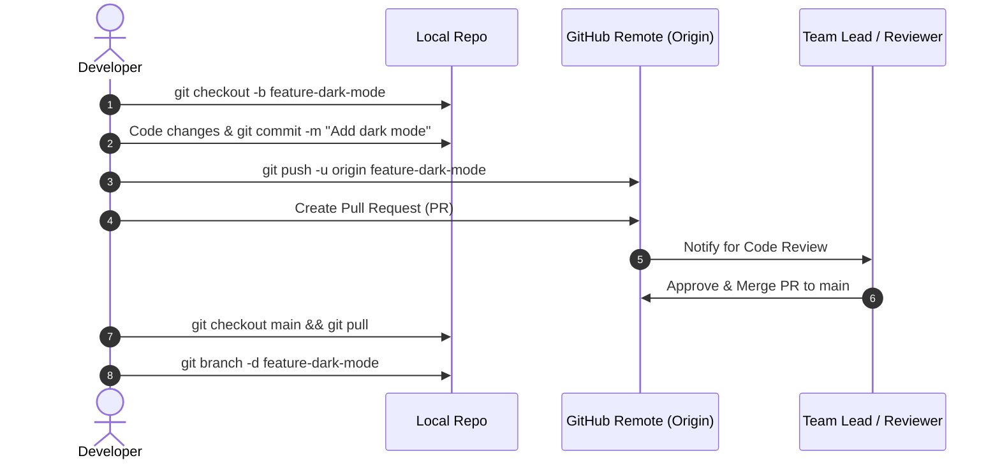

# 📑 Chapter 5: Complete Git & GitHub Commands Cheat Sheet

Yeh reference guide Git aur GitHub ke tamam ahem commands ki ek **Complete Master Cheat Sheet** hai. Ise apne project work ke doraan reference ke tor par use karein.

---

## 🎯 1. Git Configuration (Pehli Baar Setup)

```bash
# Apna naam configure karein (Har commit par yeh author name jayega)
git config --global user.name "Aapka Naam"

# Apni email configure karein
git config --global user.email "aapki@email.com"

# Default primary branch ka naam 'main' set karein
git config --global init.defaultBranch main

# Current configuration settings list check karein
git config --list

# Default terminal editor set karein (VS Code ke liye)
git config --global core.editor "code --wait"

# Terminal UI colors enable karein
git config --global color.ui auto
```

---

## 📁 2. Repository Initialize & Clone

```bash
# Current folder mein naya Git repository banayein
git init

# Existing remote repository ko download (clone) karein
git clone https://github.com/username/repo.git

# Kisi specific branch ko direct clone karein
git clone -b feature-branch https://github.com/username/repo.git

# Shallow Clone (Badi repositories ke liye sirf latest commit history download karna)
git clone --depth 1 https://github.com/username/repo.git

# Custom folder name ke sath clone karein
git clone https://github.com/username/repo.git my-custom-folder
```

---

## 📝 3. Basic Daily Workflow (Staging & Commit)

```bash
# Repository ki current status check karein
git status

# Short format status (Compact view)
git status -s

# Specific file ko staging area mein add karein
git add index.html

# Tamam modified aur new files ko stage karein
git add .

# Specific extension ki files add karein
git add *.js

# All files stage karein (including file deletions)
git add -A

# File ko staging area se unstage karein
git reset index.html
git reset                      # Saari staged files unstage karein

# Staged files ko commit (checkpoint save) karein
git commit -m "Naya feature add kiya"

# Add aur commit ek sath execute karein (Sirf tracked files ke liye)
git commit -am "Code updates"

# Last commit ka message modify karein
git commit --amend -m "Updated commit message"

# Last commit mein bhooli hui file add karein (Bina naya commit banaye)
git add missed-file.txt
git commit --amend --no-edit
```

---

## 🌿 4. Branch Management

```bash
# Local branches ki list dekhein (* current branch ko dikhata hai)
git branch

# Local aur remote dono branches ki list dekhein
git branch -a

# Nayi branch create karein
git branch feature-auth

# Nayi branch banayein aur foran uspar switch karein
git checkout -b feature-auth

# Existing branch par switch karein
git checkout feature-auth

# Modern syntax (Git 2.23+)
git switch feature-auth
git switch -c feature-auth      # Nayi branch bana kar switch karna

# Branch ka naam rename karein
git branch -m purana-naam naya-naam

# Local branch delete karein (Safe delete)
git branch -d feature-auth

# Force delete branch (Unmerged changes ke sath bhi)
git branch -D feature-auth

# Remote branch ko GitHub se delete karein
git push origin --delete feature-auth
```

---

## 🔀 5. Merge & Rebase

```bash
# Feature branch ko main branch mein merge karein
git checkout main
git merge feature-auth

# Merge conflict aane par merge process cancel karein
git merge --abort

# Rebase karein (Clean linear history bananey ke liye)
git checkout feature-auth
git rebase main

# Rebase cancel karein
git rebase --abort

# Merge conflicts resolve karne ke baad rebase continue karein
git rebase --continue
```

---

## 📤 6. Push & Pull (Remote Operations)

```bash
# Remote GitHub repository link add karein
git remote add origin https://github.com/username/repo.git

# Linked remote repositories check karein
git remote -v

# Pehli baar branch push karein (-u upstream tracking set karta hai)
git push -u origin main

# Normal push
git push

# Force push (Careful: Remote commit history overwrite ho jati hai)
git push --force
git push -f

# Remote se latest changes download aur merge karein
git pull

# Pull with rebase (Clean linear commit history)
git pull --rebase

# Sirf remote branches download karein (Merge kiye baghair)
git fetch
git fetch --all
```

---

## 📊 7. History, Log & Blame

```bash
# Poori commit history dekhein
git log

# Har commit ko ek line mein compact dekhein
git log --oneline

# Graphical commit tree dekhein
git log --graph --oneline --all

# Kisi specific file ki commit history
git log src/App.js

# Sirf aakhri 5 commits dekhein
git log -5

# Files changes ke stats ke sath history
git log --stat

# Kisi specific commit ki exact diff changes dekhein
git show 7a8b9c0

# Dekhein ke file ki har line kis developer ne aur kab likhi thi
git blame src/utils.js
```

---

## 🔍 8. Diff & Comparison

```bash
# Working directory aur staging area ke darmiyan farq dekhein
git diff

# Staged changes aur last commit ke darmiyan farq
git diff --staged

# Do commits ke darmiyan farq
git diff commit_hash_1 commit_hash_2

# Do branches ke darmiyan differences
git diff main feature-auth

# Sirf modified files ke naam dekhein
git diff --name-only
```

---

## 💾 9. Stash (Temporary Work Storage)

```bash
# Uncommitted changes ko temporarily save karke working tree saaf karein
git stash

# Description message ke sath stash karein
git stash save "WIP: Header component logic"

# Tamam saved stashes ki list dekhein
git stash list

# Stash wapas apply karein aur stash list se delete kar dein
git stash pop

# Stash apply karein lekin list mein save rehne dein
git stash apply

# Specific stash index apply karein
git stash apply stash@{1}

# Specific stash drop (delete) karein
git stash drop stash@{0}

# Tamam stashes ko permanently delete karein
git stash clear
```

---

## 🚨 10. Undo, Rollback & Revert

```bash
# Working directory ki uncommitted changes undo karein
git restore filename.txt
git checkout -- filename.txt   # Purana syntax

# File ko staging area se wapas working directory mein bhejein
git restore --staged filename.txt

# Soft Reset: Last commit undo karein (Code files un-staged rehti hain)
git reset --soft HEAD~1

# Hard Reset: Last commit aur uski tamam code changes permanently delete karein
git reset --hard HEAD~1

# Kisi specific commit par completely rollback karein
git reset --hard commit_hash

# Safe Revert: Ek naya inverse commit banayein jo purani ghalti ko reverse kare
git revert commit_hash

# Bina auto-commit kiye revert karein
git revert -n commit_hash
```

---

## 🏷️ 11. Tags & Releases

```bash
# Lightweight tag banayein
git tag v1.0.0

# Annotated tag (Author & Message ke sath)
git tag -a v1.0.0 -m "Release version 1.0.0 - Production"

# Tamam tags ki list dekhein
git tag

# Specific tag ko GitHub par push karein
git push origin v1.0.0

# Tamam local tags ko push karein
git push origin --tags

# Local tag delete karein
git tag -d v1.0.0

# Remote GitHub tag delete karein
git push origin --delete v1.0.0
```

---

## 🐙 12. GitHub CLI (`gh`) & Pull Request Workflow

### GitHub CLI Commands

```bash
# GitHub CLI mein authentication / login karein
gh auth login

# GitHub se repository clone karein
gh repo clone username/repo-name

# Terminal se naya GitHub repository banayein
gh repo create my-app --public
gh repo create my-app --private

# Repository ko fork karein
gh repo fork upstream-user/repo-name

# Terminal se GitHub Issue create karein
gh issue create --title "Login bug" --body "Login button not responding"

# Open issues ki list dekhein
gh issue list

# Terminal se Pull Request create karein
gh pr create --title "Feature: Dark Mode" --body "Implemented dark mode toggle"

# PRs ki list dekhein
gh pr list

# PR merge karein
gh pr merge 42 --merge
gh pr merge 42 --squash
```

### Standard Pull Request (PR) Step-by-Step Flow



---

## 🔗 13. Fork & Upstream Sync

```bash
# 1. Forked repository ko clone karein
git clone https://github.com/your-username/forked-repo.git

# 2. Original author ki repository ko 'upstream' remote ke tor par add karein
git remote add upstream https://github.com/original-owner/original-repo.git

# 3. Upstream se latest updates fetch karein
git fetch upstream

# 4. Apni local main branch par switch karke upstream code merge karein
git checkout main
git merge upstream/main

# 5. Updated code ko apne GitHub fork par push karein
git push origin main
```

---

> ⏭️ **Agla Qadam:** Aaiye **[Chapter 6: SSH, SCP & Rsync Complete Reference Guide](./06-ssh-scp-and-rsync-complete-guide.md)** mein remote server administration aur secure file syncing ke commands ko detail mein samjhein!
