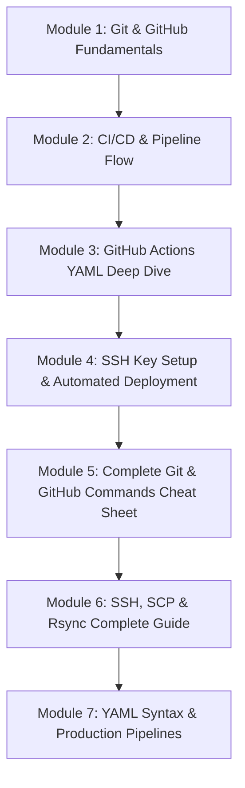

# 🚀 Complete DevOps Handbook

Khush amdeed (Welcome) to the **Complete DevOps Handbook**! 

Yeh documentation khas tor par un tamam developers, sysadmins aur students ke liye banayi gayi hai jo **Git, GitHub, CI/CD Pipelines, SSH Authentication aur GitHub Actions YAML** ko aasan aur practical tarike se Roman Urdu aur Simple English mein seekhna chahte hain.

---

## 🌟 Yeh Handbook Kis Ke Liye Hai?

* **Beginners:** Jinhein Git aur GitHub ke basic concepts aur workflows samajhne hain.
* **Full-Stack / Frontend / Backend Developers:** Jo apne code ko manually server par upload karne ke bajaye automated CI/CD pipeline lagana chahte hain.
* **DevOps Enthusiasts:** Jo SSH keys, automated runners, rsync deployments aur production YAML pipelines ko deep level par samajhna chahte hain.

---

## 📚 Handbook Structure (Index)

---

### 📖 Modules Overview

1. **[Chapter 1: Git & GitHub Fundamentals](./01-git-and-github-fundamentals.md)**
   * Git kya hai? (Time Machine analogy & Version Control System).
   * GitHub kya hai? (Cloud hosting & Developer collaboration platform).
   * Core concepts: Repository, Commit, Branch, Merge, Local vs Remote.

2. **[Chapter 2: CI/CD & Automation Flow](./02-cicd-concepts-and-pipeline-flow.md)**
   * CI (Continuous Integration) vs CD (Continuous Delivery / Deployment).
   * Complete 6-step End-to-End Pipeline flow.
   * Real-world analogies aur summary comparison tables.

3. **[Chapter 3: GitHub Actions YAML Deep Dive](./03-github-actions-yaml-deep-dive.md)**
   * Workflow file ka line-by-line breakdown (`name`, `on`, `jobs`, `runs-on`, `steps`).
   * Ready-made actions (`checkout`, `setup-node`) vs custom commands (`run`).
   * Step 6: `scp -r build/* user@server:/var/www/website/` ka deep breakdown (Deploy kahan aur kaise hota hai?).

4. **[Chapter 4: SSH Key Setup & Automated Deployment](./04-ssh-key-setup-and-server-deployment.md)**
   * Lock & Key security architecture (Public Key vs Private Key).
   * Local key pair generation (`ssh-keygen`).
   * Server par public key install karna (`~/.ssh/authorized_keys`).
   * GitHub Secrets vault (`SSH_PRIVATE_KEY`) configure karna.
   * Production-grade YAML workflow with `rsync -avz --delete`.

5. **[Chapter 5: Complete Git & GitHub Commands Cheat Sheet](./05-git-and-github-commands-cheatsheet.md)**
   * Comprehensive command reference: Config, Init, Clone, Staging, Commit, Branches, Merge, Rebase, Log, Diff, Stash, Reset, Revert, Tags, Remote.
   * GitHub CLI (`gh`) commands, Pull Request (PR) workflow, aur Fork/Upstream sync.

6. **[Chapter 6: SSH, SCP & Rsync Complete Reference Guide](./06-ssh-scp-and-rsync-complete-guide.md)**
   * SSH key types (RSA vs Ed25519) & strict Linux permissions table.
   * `ssh-copy-id`, remote command execution, EOF scripts.
   * `scp` vs `rsync` with flags (`-avz`, `--delete`, `--dry-run`, `--exclude`).
   * `~/.ssh/config` profiles aur `ssh-agent`.

7. **[Chapter 7: YAML Syntax & Production Actions Templates](./07-yaml-and-production-actions-templates.md)**
   * Complete YAML syntax rules & multiline blocks (`|`).
   * Ready-to-use production pipeline templates: Node.js Matrix CI, SSH Deployment CD, Docker Build & Push, Multi-environment deployments, Scheduled cron backups, Reusable workflows.
   * Pro tips & quick reference tables.

---

> 💡 **Tip:** Agar aap bilkul shuruat kar rahe hain, toh **Chapter 1** se start karein. Agar aapko direct GitHub Actions aur SSH deployment setup karna hai, toh **Chapter 3 aur 4** par ja sakte hain!
